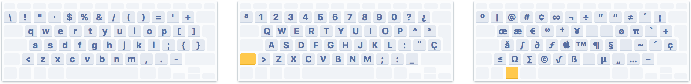

# Spanish developer keyboard layout

A modified Spanish keyboard layout for developers.

This layout is based on the [Spanish International QWERTY layout](https://en.wikipedia.org/wiki/QWERTY#Spanish), with the goal of increasing the productivity of developers that use a Spanish keyboard.

## Motivation

Programming languages were designed with an English keyboard in mind, making heavy use of the most accessible symbols of the English keyboard. Unfortunately many of those symbols are not easy to type in a Spanish keyboard, which makes coding unnecessarily uncomfortable and clumsy.

One possible solution is to switch to an English keyboard layout. However, that could be problematic for users that are used to the Spanish layout or that rely on the printed symbols for typing.

## The layout

The proposed solution is to modify the Spanish layout to make easier to type programming symbols without modification keys, while preserving their placement as much as possible:

The idea is to have a productive layout for programming with a low learning curve for Spanish keyboard users. Some sacrifices have been made to accomplish that, like introducing some redundacies (more than one way to type a symbol).

The main changes are:

- Numbers are switched with their ⇧ symbols, so they can be typed directly.
- Symbols `[]{}` can be typed directly, where `` `+´ç `` are now typed by pressing ⌥.
- The `+` symbol, being very common, can also be typed directly with the key previously assigned to `¡`.
- The `;` symbol (and `:` when pressing ⇧) can be also typed with the key previously assigned to `ñ`.

## Installation

### macOS

1. Copy `osx/SpanishDev.bundle` into:
	- `/Library/Keyboard Layouts/` to install the layout for all users
	- `~/Library/Keyboard Layouts/` to install the layout only for the current user.
2. Add the layout as an input source by navigating to _System Preferences > Keyboard > Input Sources_. Click the add button, search for Spanish language and select the _Spanish - Developer_ layout.
3. You can enable the _Show input menu in menu bar_ option to quickly switch between keyboard layouts.

## Contributions

Contributions porting this layout to other platforms like Windows or Linux will be greatly welcomed.

## License

[MIT License](LICENSE.md).
